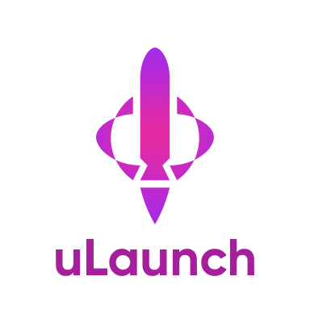
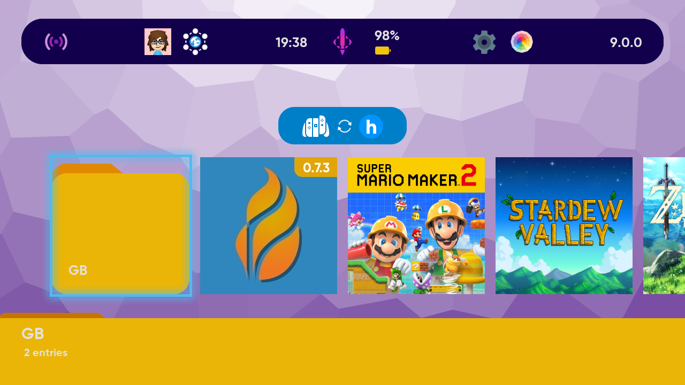
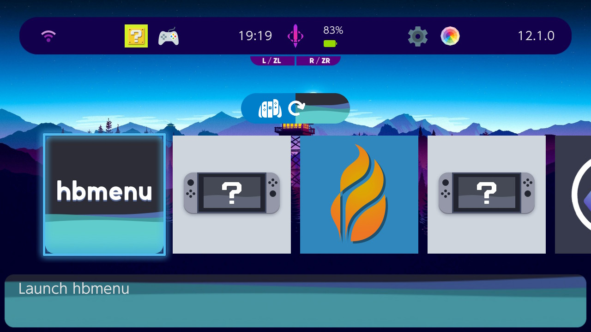
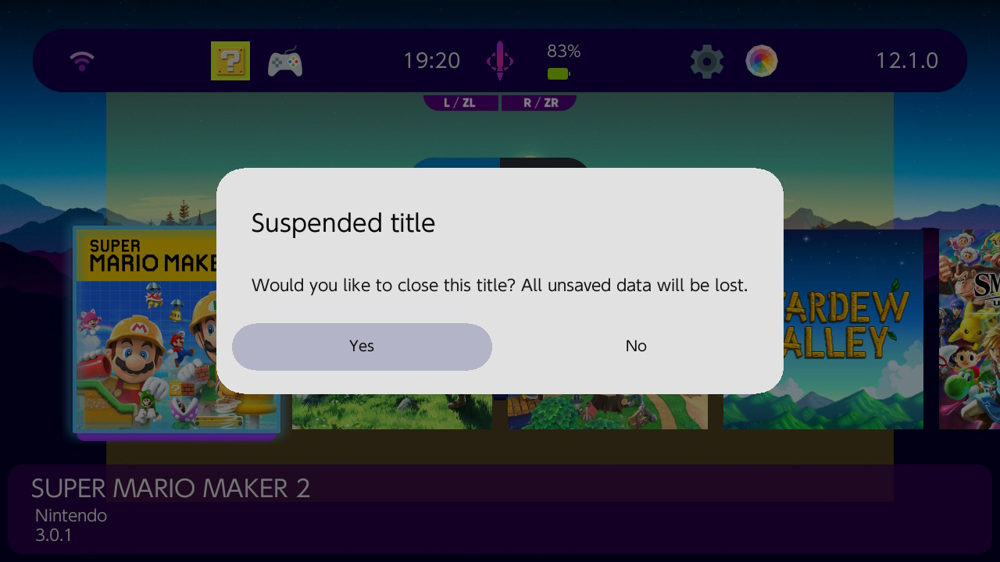
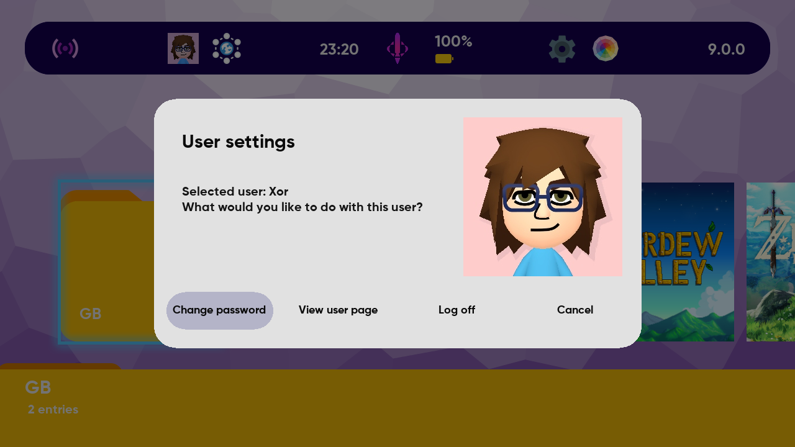
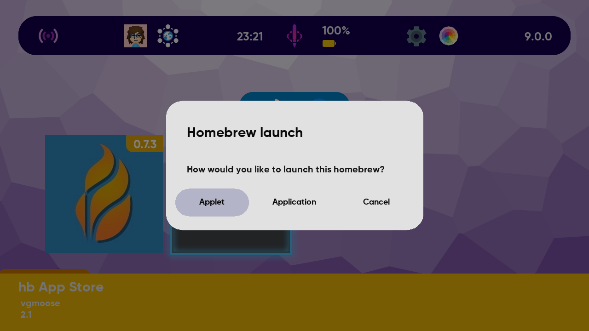
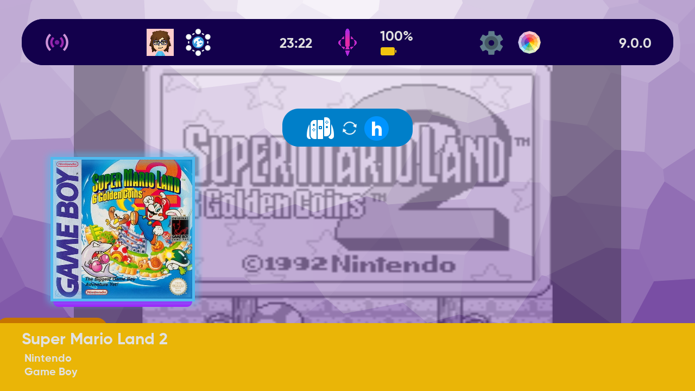

> uLaunch is a custom, open-source replacement/reimplementation for the Nintendo Switch's HOME menu (qlaunch), extending it with amazing, homebrew-oriented features!

 

 

 

uLaunch is a project which aims to replace the console's **HOME menu** with a custom, homebrew-oriented one.

- This isn't some kind of HOME menu extension, injection, patch, etc. uLaunch is a **complete** reimplementation, 100% open-source, which also takes over eShop and Parental control applets  (all of them pretty much useless with this reimpl) for its extended functionality.

- For those who are interested in how the UI was done, this project is, like [Goldleaf](https://github.com/XorTroll/Goldleaf), a good example of how powerful [Plutonium libraries](https://github.com/XorTroll/Plutonium) can be in order to make beautiful UIs.

## Get it from [here](https://github.com/XorTroll/uLaunch/releases/latest)!

### For support regarding this project, please use this [Google Form](https://forms.gle/wzovMN1ghfJhSswHA)!

### Want to create **custom forwarders** (eg. RetroArch ones)? check **uViewer** tool in [latest releases](https://github.com/XorTroll/uLaunch/releases/latest)!

### Want to find **themes** for uLaunch? Check the [r/uLaunchThemes subreddit](https://www.reddit.com/r/uLaunchThemes/)!

### For more detailed **information** about the whole project (and *themeing* too), check its [wiki](https://github.com/XorTroll/uLaunch/wiki)!

## Features

**List of HOME menu features uLaunch has**:

- Proper launching and foreground management: launch, suspend and close applications and applets

- Proper general channel handling (some of it might be not implemented): sleep, shutdown, reboot, HOME menu press detection... 

- Settings:

  - Show connected WiFi network's name, MAC and IP address...
  
  - Open connection applet in case user wants to change network settings

  - Change console's language and show active one

  - Change console's nickname and show current one

- User features:

  - Allow creating user on the startup menu

  - Show user's page (in order to edit nickname, icon, friends...)

- *Homebrew support*

  - Launching as applets (no need of **Album**!)

  - Launching as **applications** (using a **donor title**!)

  - Custom basic homebrew menu

  - Option to add custom NRO accessors to main menu (homebrew or custom items easily accessible, no more need of **forwarders**!)

- *UI*

  - **Themes** (different to official HOME menu themes/NXThemes)

    - Custom icons, menu assets and graphics (custom images, colors, sizes, positions...), background...

    - Custom **background music** and **sound effects**!

  - **Folders** in order to keep your main menu organized!

- *Users*

  - PC-like login on startup (select user and use it for everything, log off, register/change/remove password...)

  - **User password** support! (up to 15 characters)

- *Miscellaneous extras*

  - Web browsing (via web-applet) directly from the main menu!

  - **Console screen capturing** from PC itself (*Windows*-only) via USB-C cable and *uViewer* tool!

## Disclaimer

### Ban risks

While no bans have been reported related to using uLaunch, replacing the retail HOME menu's functionality is never a completely safe idea, so always use it at your own risk.

## TODO list

- Improve Daemons's IPC with two services, one only for Daemon and the other one for any process to interact with uLaunch:

  - Easy way to detect whether uLaunch is present

  - Get whether a title/homebrew is opened

- (check suggestions and bugs in issues for user-submitted TODOs)

## Compiling

You will need devkitPro, devkitA64, libnx and all SDL2 libraries for switch development.

Clone (**recursively!**) this repo (since it uses Atmosphere-libs and Plutonium submodules) and just enter `make` in the command line. It should build everything and generate a `SdOut` folder whose contents sould directly be copied to the root of a console SD card.

In order to only build a certain subproject, you can run `make` plus the subproject's name (`make daemon`, `make hbtarget` or `make menu`).

## Credits

- SciresM for [Atmosphere-libs](https://github.com/Atmosphere-NX/Atmosphere-libs).

- Switchbrew team for [libnx](https://github.com/switchbrew/libnx) and [nx-hbloader](https://github.com/switchbrew/nx-hbloader), the base of the uHbTarget processes (they're essentially wrappers of nx-hbloader). This project also makes use of hx-hbmenu's icon.

- C4Phoenix for the amazing design of this project's logo.

- [takoyaki](https://github.com/takoyaki99) for Google Forms-based issues support.

- [Icons8](https://icons8.com/) website for a big part of the icons used by the default style.

- Several scene developers for their help with small issues or features.

- Everyone from Discord or other places whose suggestions made this project a little bit better ;)
