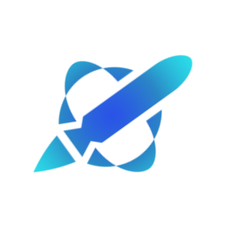
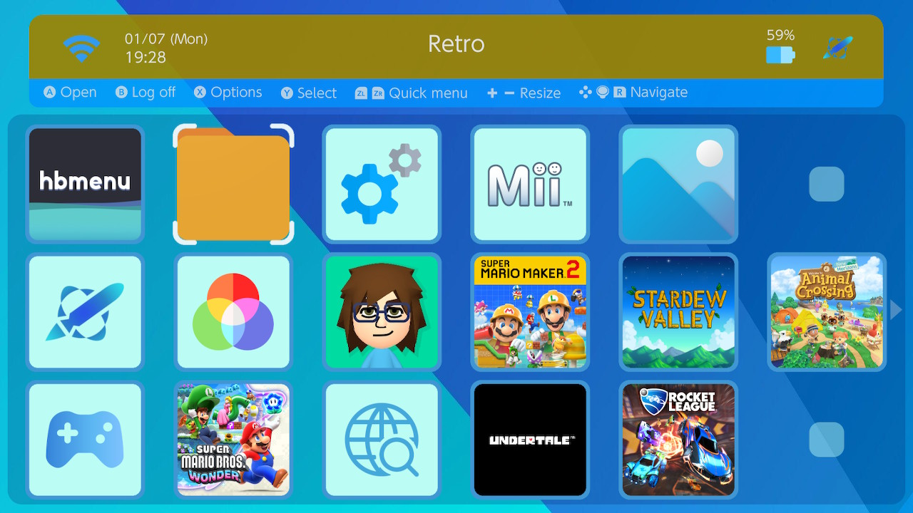
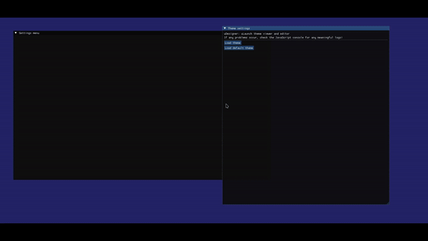

  

  
  
  

  
  
  

  

### Want to find **themes** for uLaunch? Check the [r/uLaunchThemes subreddit](https://www.reddit.com/r/uLaunchThemes/) or the [Discord server](https://discord.gg/3KpFyaH)!

### Want to make your own uLaunch **themes**? Check our [web theme editor](https://xortroll.github.io/uLaunch/) or the [wiki](https://github.com/XorTroll/uLaunch/wiki)!

- [Features](#features)
  - [Custom features](#custom-features)
  - [Implemented base features](#implemented-base-features)
  - [Unimplemented base features](#unimplemented-base-features)
    - [Planned to be implemented](#planned-to-be-implemented)
    - [Not planned to be implemented (at least for now)](#not-planned-to-be-implemented-at-least-for-now)
- [Setup](#setup)
  - [Installing uLaunch](#installing-ulaunch)
  - [Removing uLaunch](#removing-ulaunch)
- [FAQ](#faq)
- [Components](#components)
  - [uSystem](#usystem)
  - [uMenu](#umenu)
  - [uLoader](#uloader)
  - [uManager](#umanager)
- [Building](#building)
- [Credits](#credits)

## Features

### Custom features

List of unique extensions that the official HOME menu lacks:

- User login system (login once, use that user for everything)

- Grid-like main menu, deeply inspired by the 3DS menu (and partially DSi/Wii menus as well), easier than ever to navigate and customize

  - The grid can be resized like in 3DS menus

  - Entries can be moved as desired

- Folders, subfolders...

- Homebrew directly launchable straight from main menu as an applet or an application (using applications as donors)

- Extensive themeing support

  - Backgrounds, icons, etc.

  - BGM and many sound effects

- Web browser easily accessible straight from main menu

- Mii editor easily accessible straight from main menu

- Screen capture to PC support via USB

- Display system version + Atmosphère version + EmuMMC presence independently, in a nicer way

- Better display when gamecard fails to mount

- 1080p resolution

### Implemented base features

List of implemented official HOME menu features:

- Application launching, suspending and closing

- Applet launching and closing

- User page

- Controller support

- Settings (only a handful are so far implemented):

  - Console version

  - Atmosphère version

  - EmuMMC presence

  - Console nickname

  - Console timezone

  - WiFi connection name/WiFi settings

  - Console language

  - Console information upload (enable/disable)

  - Bluetooth (enable/disable)

  - NFC (enable/disable)

  - Automatic application download (enable/disable)

  - Automatic console update (enable/disable)

  - Wireless LAN (enable/disable)

  - Console serial number

  - Show console IP/MAC address

- General channel/applet messages (some of them aren't implemented yet):

  - HOME button detection

  - Power off, sleep, reboot

  - SD card removal

  - Gamecard failing to mount

### Unimplemented base features

List of not implemented official HOME menu features:

#### Planned to be implemented

- Auto-sleep after a certain amount of time

- Several unimplemented settings

- Several unimplemented general channel/applet messages

- Console updating

#### Not planned to be implemented (at least for now)

- eShop functionality

- Parental control

- Application (game) updates

## Setup

### Installing uLaunch

1. Download the latest release ZIP.

> Note: this project is released and meant to be used with Atmosphère, so use it with different CFWs at your own risk.

2. Copy everything inside the ZIP to the root of your SD card.

   - If you have never used uLaunch or any kind of HOME menu replacement (NXThemes don't count) you wouldn't need to overwrite any files.

   - You don't need to remove your normal HOME menu themes (NXThemes) in order to install uLaunch. Those themes are at a `romfs` dir inside `contents/0100000000001000`, while uLaunch's only file in that folder is `contents/0100000000001000/exefs.nsp`.

3. Launch your CFW (using emuMMC or sysMMC shouldn't make a difference) and enjoy your new HOME menu!

### Removing uLaunch

> Important: make sure you don't remove anything else but the stuff mentioned here, in order to avoid any potential trouble!

1. If you'd like to keep your custom themes, menu entries, config, etc. then just use the `uManager` tool to disable uLaunch. This doesn't remove any data, allowing you to re-enable it back any moment.

2. If you'd like to remove everything permanently, then you will have to remove `atmosphere/contents/0100000000001000` and `ulaunch` folders on the SD card. If you also wish to remove `uManager`, then remove `switch/uManager.nro`.

> Note: if you use any HOME menu modification - like NXThemes - make sure you do not delete the entire `0100000000001000` folder, just the `exefs.nsp` file!

## FAQ

- uLaunch gives me a blackscreen. How can I fix it?

  - First of all, make sure you're using the latest release of uLaunch.

  - If new firmware updates or new Atmosphère versions have been released, you might need to wait for a new release to be dropped, and in the meantime you might be able to use dev/testing builds from our [Discord server](https://discord.gg/3KpFyaH).

  - The *log files* uLaunch's components generate inside `ulaunch` folder can be really helpful when sharing your issue in Discord or GitHub. Make sure you don't reboot again into uLaunch, since the log files will be overwritten! Otherwise, just replicate the bug and share/copy the log files before reloading anything.

  - In more extreme cases, uLaunch's blackscreens might also be caused due bad handling of invalid theme/entry JSON files. The JSONs might have been corrupted (due to ExFAT, other homebrews...) so try deleting them.

- Why can't I access the usual system settings, while I can access other normal system menus like the album, mii editor, user page, etc.?

  - This is an unfortunate technical issue. While the web browser, user page, album... are separate applets (separate programs, independent from the HOME menu itself) system settings are *actually* part of HOME menu itself. Therefore, we have to implement manually all of them... which requires its effort, so only a bunch of the available settings (plus a few extras) are currently available here, while the remaining settings are being reversed and implemented.

- Will using uLaunch get me banned online?

  - There have been some cases where using uLaunch may have caused bans. Keep in mind that replacing the official HOME menu's functionality is never a completely safe idea, so always use it at your own risk. Since uLaunch doesn't perform any telemetry or communications with Nintendo servers, they might be able to notice you are running something different from the original HOME menu.

- Why does uLaunch (sometimes) feel slower than the official HOME menu?

  - There are several possible reasons:

    - uLaunch loads more content than the official HOME menu when loading. Most of the official HOME menu's UI are solid colors, while uLaunch loads several images, etc. Being customizable comes with minor drawbacks, like this one.

    - Icons are lazily loaded, so for menus with many entries (essentially for people having a ton of games) navigating through the menu will be slightly laggy until everything loads, which will just take a few seconds. The 3DS menu has similar laggy moments, by the way ;)

    - Aside from the two excuses above, there is always room for further optimizations in uLaunch's code. Feel free to submit any issues of excessive lag/slowdowns, I'll do my best to improve it :)

## Components

### uSystem

uSystem is the *system applet process* replacement - the actual, literal HOME menu replacement - and serves as a *backend* for the actual menu the user will interact with (uMenu).

uSystem handles essential HOME menu functionality, like suspending/closing titles, closing applets, detecting power button or HOME button presses... it's very lightweight since it must always be running in the background.

It also communicates with uMenu for anything necessary via their `smi` communication system.

### uMenu

uMenu is a *library applet* (running temporarily over the *eShop applet* when launched) which is **the HOME menu the user will see and interact with**.

uMenu is launched and terminated by uSystem when necessary. In order to deal with special HOME menu functionality (closing titles, launching them...) it communicates with uSystem via their `smi` communication system.

### uLoader

uLoader is a custom [nx-hbloader](https://github.com/switchbrew/nx-hbloader/releases) implementation, which allows to easily *launch homebrew* as applets or applications or even to *choose homebrews* as some sort of file dialog.

### uManager

uManager is a homebrew NRO used for controlling key uLaunch aspects.

Only those tasks which cannot be performed outside uLaunch are controlled (like enabling or disabling uLaunch itself, hence why this is a separate NRO and not part of uMenu/etc), while everything else is controlled and managed on uLaunch itself.

## Building

> Note that [workflows](https://github.com/XorTroll/uLaunch/actions) automatically build and upload nightly builds for every commit!

This project is, like [Goldleaf](https://github.com/XorTroll/Goldleaf), based on my [Plutonium](https://github.com/XorTroll/Plutonium) UI libraries.

You will need *devkitPro*, *devkitA64*, *libnx* and all SDL2 libraries for Switch development (make sure their packages are installed): `switch-sdl2 switch-freetype switch-glad switch-libdrm_nouveau switch-sdl2_gfx switch-sdl2_image switch-sdl2_ttf switch-sdl2_mixer`

Clone **recursively** this repository and just enter `make` in the command line. It should build everything and generate a `SdOut` folder whose contents sould directly be copied to the root of a console SD card.

In order to only build a certain subproject, you can run `make` plus the subproject's name: `make usystem`, `make uloader`, `make umenu`, `make umanager`

## Credits

- SciresM for [Atmosphere-libs](https://github.com/Atmosphere-NX/Atmosphere-libs).

- Switchbrew team for [libnx](https://github.com/switchbrew/libnx) and [nx-hbloader](https://github.com/switchbrew/nx-hbloader), the base of uLoader, as well as their wonderful [wiki](https://switchbrew.org/wiki/Main_Page).

- C4Phoenix for the original design of this project's logo.

- [Iconos8](https://iconos8.es/), [WallpaperAccess](https://wallpaperaccess.com/), [Flaticon](https://www.flaticon.com/), [Iconfinder](https://www.iconfinder.com/) and [Icon Archive](https://www.iconarchive.com/) as the bases for most of the icons used by the default menu theme.

- Several scene developers for their help with small issues or features.

- uMenu/uManager translations: [DDinghoya](https://github.com/DDinghoya) for Korean, [NedcloarBR](https://github.com/NedcloarBR) for Brazilian Portuguese

- Everyone from my Discord and other places whose suggestions made this project a little bit better! Specially all the testers for being essential in reporting bugs and helping a lot with the project's development <3
